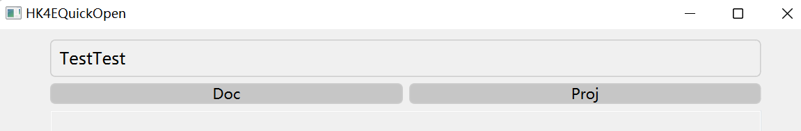

# QuickOpenFolderTool

一个直接打开对应路径文件夹的快捷工具。

build出exe到Release文件夹，用windeployqt工具打包出完整的exe。将path.json放在exe同目录下。

```json
{
  "path":
  [
    {
      "name": "TestTest",
      "basePath": "F:/",
      "buttons":
      [
        {
          "buttonName": "Doc",
          "appendPath": "Documents/"
        },
        {
          "buttonName": "Proj",
          "appendPath": "Projects/"
        }
      ]
    }
  ]
}
```

就会按照path.json生成目录按钮。点击直接打开对应的文件夹。


